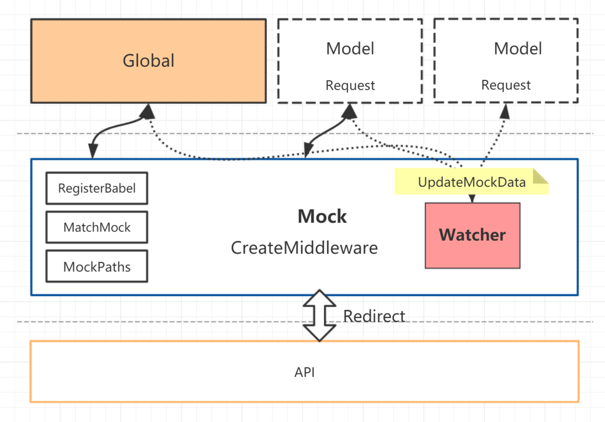

# 数据的 Mock

- 目的：Mock 数据是前端开发过程中必不可少的一环，是分离前后端开发的关键链路。通过预先模拟请求数据甚至逻辑，能够让前端开发独立自主，不会被服务端的开发所阻塞。
- 原理：在项目启动的时候，为项目创建一个 node serve，同时注入 Mockjs，产生一套运行在本地的 API 数据接口服务，当客户端发送请求时，本地启动的 Mock 服务会自动匹配请求路径，如果有匹配到，将请求通过配置处理，直接返回数据（也可以通过函数重定向到另一个服务）。否则进入 proxy 代理到服务器。
- 流程原理图：

## 模块化的 Mock 文件

框架 约定 `/mock` 文件夹下的文件即 mock 文件。对于业务功能，为了让项目代码组织更加规范，让开发能够更方便的定位到相关页面组件代码，我们约定以下规范：

```bash
├── mock                 // 本地模拟数据
├── src
└── views
    ├── Order
    |   └── index.ts
    |── index.tsx
    └── Welcome
        |── components  // Welcome 下公用的组件集合
        |── _mock.js    // Welcome 下数据的 Mock
        |── index.vue
        |── model.js    // Welcome 下的 vuex model
        └── service.ts  // Welcome 下的 后台接口服务
```

## 使用 Mock 功能

- 约定 `mock` 文件夹下的 js 、ts 文件即 mock 文件；
- 在项目 src 文件夹下的 `_mock.js`、`_mock.ts` 均被视为 Mockjs 文件；
- 根目录 `mock` 文件夹下的 Mockjs 文件在项目启动后全程识别、更新、监听；
- src 文件夹下的 Mockjs 文件，在项目启动时注入，并监听变化，**后期新增的 Mockjs 文件暂不支持监听识别**；
- Mockjs 请按照 AMD 规范进行编写！

```js
export default {
  // 支持值为 Object 和 Array
  'GET /api/users': { users: [1, 2] },

  // GET POST 可省略
  '/api/users/1': { id: 1 },

  // 支持自定义函数，API 参考 express@4
  'POST /api/users/create': (req, res) => {
    res.end('OK');
  },
};
```

### 包含逻辑的 Mock

```js
'POST /api/login/account': async (req: Request, res: Response) => {
    const { password, userName, type } = req.body;
    await waitTime(2000);
    if (password === '******' && userName === '***admin***') {
      res.send({
        status: 'ok',
        data: {},
      });
      return;
    }
    res.status(403).send({
      status: 'ok',
      data: {},
    });
},
```

### 模拟延迟

为了更加真实地模拟网络数据请求，往往需要模拟网络延迟时间。

```js
const waitTime = (time: number = 100) => {
  return new Promise((resolve) => {
    const timer = setTimeout(() => {
      resolve(true);
      clearTimeout(timer);
    }, time);
  });
};

'POST /api/forms': async (req, res) => {
  await waitTime(2000);
  res.send('Ok');
},
```

### 添加跨域请求头

```js
'POST /api/users/create': (req, res) => {
  ...
  res.setHeader('Access-Control-Allow-Origin', '*');
  ...
},
```

### 响应状态

```js
'POST /api/users/create': (req, res) => {
  ...
  res.status(403).send({});
  ...
},
```

